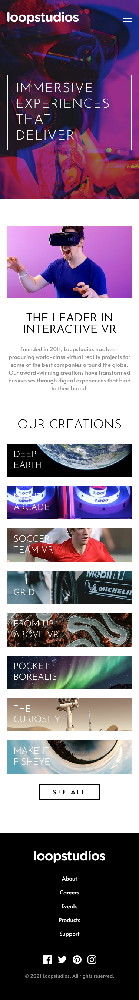

# Frontend Mentor - Loopstudios landing page solution

This is a solution to the [Loopstudios landing page challenge on Frontend Mentor](https://www.frontendmentor.io/challenges/loopstudios-landing-page-N88J5Onjw). Frontend Mentor challenges help you improve your coding skills by building realistic projects. 

### Screenshot

### Links

- Solution URL: [Add solution URL here](https://www.frontendmentor.io/solutions/responsive-landing-page-using-grid-and-clamp-SSnsc26p3)
- Live Site URL: [Add live site URL here](https://purple-mountain.github.io/Loopstudios-landing-page/)

### Built with

- Semantic HTML5 markup
- CSS custom properties
- Flexbox
- CSS Grid
- Mobile-first workflow
- Scss

## Author

- Frontend Mentor - [@yourusername](https://www.frontendmentor.io/profile/purple-mountain)

